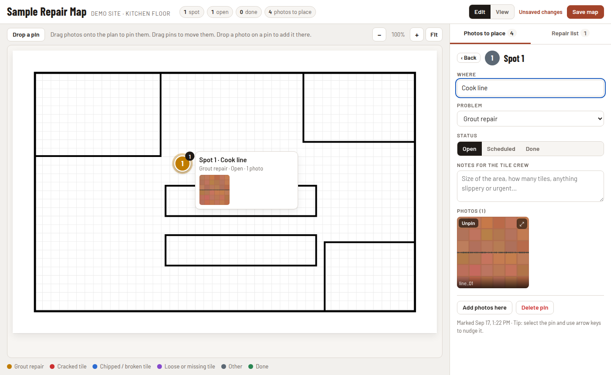
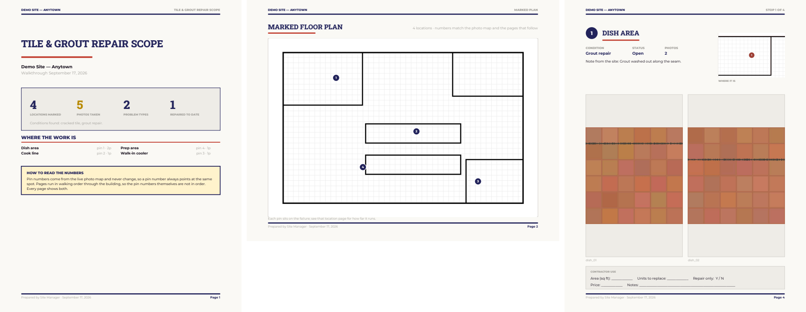

# R3p4irm4p

Pin repair photos to a floor plan, then print the result as a scope package a contractor can price.

Built for a restaurant kitchen floor — dozens of photos of failed grout, no good way to say *where* each one was. It works for any building and any kind of damage: a warehouse, a store remodel punch list, roof leaks, a rental turnover.



Two pieces:

- **The map** — one self-contained HTML file with the plan and every photo inside it. Drag a photo onto the plan and it becomes a numbered pin. Drag pins to move them. Click a pin to record what's wrong, the status, and notes. It runs from a local file, and works on a phone.
- **The PDF** — the same data as a printable package: marked plan, a worksheet with blank quantity and price columns, and one page per location with its photos and a close-up of where it sits.



## Quick start

```bash
pip install -r requirements.txt

# 1. build the map from a plan image and a folder of photos
python tools/build_map.py --plan plan.png --photos ./photos --out map.html \
    --title "Kitchen Tile Map" --subtitle "North site · kitchen floor" --hints examples/hints.json

# 2. open map.html, drag the photos onto the plan, then save the page
#    (see "Saving" below — a local file can't save itself)

# 3. pull the pins back out and print the package
python tools/extract_state.py map.html --out state.json
python tools/build_pdf.py state.json --out scope.pdf \
    --site "North Site — Main St" --prepared-by "A. Manager"
```

No photos handy? `python examples/make_sample.py` writes a synthetic plan and a few fake damage photos to try the whole flow.

## Using the map

| Action | How |
|---|---|
| Pin a photo | Drag it from the tray onto the plan |
| Pin a whole group | Drag the group's **Place all** button onto the plan |
| Add to an existing pin | Drag a photo onto that pin |
| Move a pin | Drag it, or select it and use the arrow keys |
| See a pin's photos | Hover it, or click for the full panel |
| On a phone | Tap a photo, then tap the plan. Press and hold also drags. |
| Add photos later | Drop image files on the page, or use **Add more photos** (opens the camera on a phone) |
| Unpin | Drag a photo back to the tray, or use **Unpin** in the pin's panel |

Photos are grouped in the tray by file name, and a new pin borrows its name from the photo that made it. That mapping lives in a hints file:

```json
[["^dish", "Dish area"], ["^line", "Cook line"], ["^cooler", "Walk-in cooler"]]
```

Left side is a regular expression matched against the file name, right side is the area name. Name photos `dish_01.jpg`, `line_03.jpg` and the map organizes itself.

## Saving

The map keeps everything inside the HTML file, which is what makes it portable — but a file opened from disk cannot overwrite itself. Two ways to keep changes:

**Published as a Claude Artifact (what this was built for).** Publish `map.html` with the `artifact` capability and the **Save map** button writes a new version of the page through `claude.use("artifact")`. Everyone with the link then sees the current pins, and only people with write access can save. Unsaved work is kept in the browser's local storage and offered back on the next visit.

**Locally.** Pin everything in one sitting and use the browser's *Save page as*, or run `build_map.py` again with `--state state.json` to rebuild the file with the pins carried forward.

## Files

```
app/map-template.html    the map itself — one file, no build step, no dependencies
tools/build_map.py       plan + photo folder -> map.html
tools/extract_state.py   map.html -> state.json (and optionally the photos back out)
tools/build_pdf.py       state.json -> scope.pdf
examples/                synthetic sample site and a hints file
```

### state.json

```jsonc
{
  "plan":  "data:image/png;base64,...",       // the floor plan
  "photos": { "p001": { "n": "dish_01", "s": "data:image/jpeg;base64,..." } },
  "order":  ["p001", "p002"],                  // tray order
  "pins": [{
    "id": "k1", "no": 1,                       // pin number — stable, never renumbered
    "x": 0.42, "y": 0.68,                      // position as a fraction of the plan
    "label": "Dish area",
    "issue": "grout",                          // grout | cracked | chipped | loose | other
    "status": "open",                          // open | sched | done
    "note": "",
    "photos": ["p001", "p002"],
    "created": "2026-09-17T12:00:00Z"
  }],
  "hints": [["^dish", "Dish area"]]
}
```

Pin numbers are assigned once and never change, so a number always points at the same piece of floor. The PDF therefore **orders pages as a walk** through the building (horizontal bands, left to right) and prints both the pin number and "Stop 4 of 18" on each page.

## The PDF

```
python tools/build_pdf.py state.json --out scope.pdf \
    --title "TILE & GROUT REPAIR SCOPE" \
    --site "North Site — Main St" \
    --prepared-by "A. Manager" \
    --surface "kitchen and service floor" \
    --link "https://…"          # optional, prints the live map link on the cover
    --theme theme.json          # optional colours
    --fonts ./assets/fonts      # optional TTFs, falls back to Helvetica
```

Pages: cover with counts and a breakdown by area · marked plan (landscape) · scope worksheet with blank **Area / sq ft** and **Price** columns and a next-actions block · one page per location with photos, a locator crop and a contractor-use box · approval and sign-off.

Colours come from `--theme` (a small JSON of hex values) so the package can carry a company's own palette. Fonts are optional; point `--fonts` at a folder holding `Montserrat-Regular.ttf`, `Montserrat-Bold.ttf`, `Montserrat-ExtraBold.ttf` and `RobotoSlab-ExtraBold.ttf` (both families are free — OFL and Apache 2.0) and the output uses them.

## Limits worth knowing

- Photos are re-encoded to 1100 px at quality 68 (`--max-px`, `--quality`). About 40 photos land near 5 MB.
- A Claude Artifact page caps at 16 MB, and every save re-uploads the whole page. Past ~100 photos, split by area into separate maps.
- The plan is a plain image. There is no scale, so square footage is the contractor's to measure — that's what the blank column is for.
- Browser storage in the map is a per-browser backup only. The saved page is the record.

## License

Proprietary — all rights reserved. See [LICENSE](LICENSE). Not for use,
copying or distribution without written permission.
